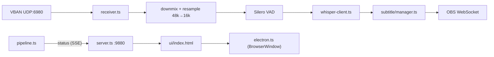

# CLAUDE.md

## Project

jimaku-translator — OBS リアルタイム字幕システム。VBAN (UDP) で OBS の音声を受信し、Whisper で JA 認識 + EN 翻訳を行い、OBS WebSocket v5 で字幕テキストソースを更新する Electron アプリケーション。GUI でステータス表示・設定変更が可能。

## Stack

- Node.js 20+, TypeScript 5.7, CJS (CommonJS 出力)
- Electron 40 (GUI ウィンドウ + パッケージング)
- obs-websocket-js ^5.0 (OBS WebSocket v5 クライアント)
- onnxruntime-node ^1.17 (Silero VAD)
- smol-toml (設定ファイル読み込み)
- vitest 2.x (ユニットテスト)
- Playwright (E2E テスト)
- electron-builder (Windows/macOS パッケージング)
- 外部プロセス: whisper.cpp server (HTTP API)

## Commands

```bash
npm run dev           # CLI モード (tsx + GUI サーバー)
npm run build         # tsc ビルド → dist/ + UI コピー
npm run start         # ビルド済み CLI モード実行
npm run electron      # Electron GUI 起動
npm run dist:win      # Windows インストーラー (.exe) 生成
npm run dist:mac      # macOS ディスクイメージ (.dmg) 生成
npm test              # vitest ユニットテスト
npm run test:watch    # vitest ウォッチモード
npm run test:e2e      # Playwright E2E テスト
```

## Architecture



## Directory Layout

```
src/
  index.ts              CLI エントリポイント
  electron.ts           Electron メインプロセス
  pipeline.ts           パイプラインロジック (EventEmitter)
  server.ts             HTTP サーバー (REST API + SSE)
  config.ts             TOML 読み込み + バリデーション
  ui/
    index.html          Web UI (インライン CSS/JS、ダークテーマ)
  vban/
    protocol.ts         VBAN パケット定義・パーサー (28B header + PCM)
    receiver.ts         UDP ソケット + EventEmitter
  audio/
    resample.ts         stereo→mono + 48kHz→16kHz (7-tap FIR decimation)
    ring-buffer.ts      INT16 リングバッファ
    vad.ts              Silero VAD v5 ONNX ラッパー (512-sample chunks)
    wav.ts              INT16 mono PCM → WAV エンコーダ
  recognition/
    whisper-client.ts   whisper.cpp server HTTP クライアント (timeout + retry)
    whisper-process.ts  whisper-server 子プロセス管理 (spawn/kill/health poll)
    whisper-setup.ts    バイナリ/モデル レジストリ + ダウンロード + GPU 検出
  obs/
    client.ts           OBS WebSocket クライアント (自動再接続、テキストソース列挙)
  subtitle/
    manager.ts          字幕表示・自動クリア・行折り返し
tests/                  vitest ユニットテスト
e2e/                    Playwright E2E テスト
models/
  silero_vad.onnx       Silero VAD モデル
docs/
  security-audit.md     セキュリティ監査レポート
config.toml             デフォルト設定
```

## Conventions

- import には `.js` 拡張子を付ける (CJS + Node16 moduleResolution で必要)
- ユニットテストは `tests/` に `*.test.ts`、E2E テストは `e2e/` に配置
- エラーは握りつぶさず、パイプラインの安全な箇所でキャッチしてログ出力
- OBS WebSocket 呼び出しは `isConnected()` ガード必須

## Key Design Decisions

- **VBAN パーサーは自前実装**: 28B 固定ヘッダで単純。外部ライブラリ不使用。`node:dgram` のみ
- **リサンプルは受信側**: obs-vban で 16kHz 出力も可能だが、48kHz 送信 + アプリ側変換の方が柔軟
- **whisper.cpp は別プロセス**: HTTP API で分離。`binary` 設定時はアプリが子プロセスとして自動起動/停止。空の場合は手動管理
- **推論キュー上限 3**: Whisper が遅い場合は古いセグメントを破棄
- **OBS 自動再接続**: 5 秒間隔。初回接続失敗時も自動リトライ (OBS 後起動に対応)。切断中の字幕更新は安全にスキップ
- **GUI は localhost HTTP + SSE**: `node:http` サーバー (port 9880) で REST API + SSE を提供。Electron は `BrowserWindow` で localhost をロード。CLI モードでもブラウザから GUI にアクセス可能
- **E2E テストは HTTP サーバー直接テスト**: Playwright の Electron 統合は Chromium バージョン制約があるため、HTTP サーバーを `webServer` として起動し通常ブラウザでテスト
- **macOS Whisper バイナリは Homebrew 管理**: whisper.cpp の GitHub Releases に macOS ビルドが無いため、`brew install whisper-cpp` で導入。`getInstalledBinary('homebrew')` は `/opt/homebrew/bin` または `/usr/local/bin` を検出。GUI の「Download」ボタンは `brew install` を実行
- **設定変更は即時反映**: GUI から設定保存すると全セクション (OBS, VBAN, Subtitle, VAD, Audio) がメモリ上で即時更新される。VBAN ポート変更は UDP ソケットを自動再バインド。Whisper の binary/model 変更のみ再起動が必要
- **Whisper 推論は逐次実行**: whisper.cpp server はシングルスレッド。並列リクエストは結果を破損するため、transcribe → translate を順次実行
- **モデルごとの翻訳可否**: `canTranslate` フラグで制御。turbo 系・kotoba 系・anime-whisper は翻訳不可 (distil-whisper ベースで翻訳タスク未保持)。翻訳が必要な場合はオリジナル Whisper モデル (large-v3, medium, small, base) を使用
- **Silero VAD**: 512-sample チャンク + 64-sample コンテキスト (入力 [1, 576])。feedQueue は Promise チェーンで直列化、深さ 4 上限でドロップ、`.catch(() => {})` でチェーン断絶防止。30 秒間の非発話継続で LSTM 隠れ状態を自動リセット。500ms の pre-speech リングバッファで発話先頭の立ち上がりを補完
- **認識精度向上のための音声前処理**: (1) RMS ゲート: VAD 前に RMS を計算し `audio.rms_gate_db` (デフォルト -60、上限 -30) 未満なら VAD feed をスキップ。VAD 状態と pre-speech バッファが凍結されるため立ち上がり取りこぼしなし。(2) 発話セグメント正規化: VAD emit 時点で [src/audio/level.ts](src/audio/level.ts) の `normalizeToTarget()` で RMS を測定し `audio.normalize_target_dbfs` (デフォルト -6) まで増幅、最大ゲイン +20 dB でノイズフロア増幅を抑制、減衰は行わない。正規化ターゲットは GUI 非表示で `config.local.toml` のみから変更可能。(3) レベルメーター表示も peak → RMS に変更し、ゲート閾値との直接比較を可能に
- **並行ダウンロード対応**: サーバーは Map で複数ダウンロードを管理。UI は動的プログレスバーで各ダウンロードの進捗を個別表示。同一リソースの重複ダウンロードは 409 で拒否
- **ダウンロード整合性検証**: SHA-256 ハッシュをサイドカーファイル (`.sha256`) に保存。サイドカー不在 = 未完了としてインストール状態を拒否
- **Whisper server ポート自動割り当て**: managed process 使用時、`net.createServer` で port 0 バインドして空きポートを自動取得。GUI から server フィールドを削除
- **ウインドウ位置復元**: Electron 終了時に `window-state.json` に bounds を保存、次回起動時に復元。ディスプレイ外の場合はデフォルト位置
- **CJS 出力**: Electron の `require('electron')` と `onnxruntime-node` が ESM interop で正しく動作しないため、`tsconfig.json` で `module: CommonJS` を使用
- **asar integrity afterPack 修正**: electron-builder が asar ファイナライズ前にハッシュを計算するバグがあるため、`afterPack.cjs` で SHA-256 + 4MB ブロック配列を再計算して Info.plist を上書き。`execFileSync` (引数配列) を使用しコマンドインジェクションを防止
- **onnxruntime-node は asarUnpack**: ネイティブ `.node` バイナリは asar 内から読めないため `asarUnpack` で展開
- **多重起動防止**: `app.requestSingleInstanceLock()` で単一インスタンスを保証。2 回目の起動は既存ウィンドウをフォーカス
- **OBS 字幕エラーは非致命的**: `subtitle.show()` の失敗は OBS 接続失敗・推論失敗と分離してログ出力。推論結果は保持され GUI に表示される
- **GUI 折りたたみ + ウィンドウ高さ追従**: Configuration 全体・各セクション・Log パネルが折りたたみ可能。状態は `localStorage` に永続化。折りたたみ時に Electron ウィンドウ高さをコンテンツに追従させ、展開時は保存された最大高さを上限として拡大
- **UI 多言語対応 (EN/JA)**: `data-i18n` 属性で翻訳キーを指定。言語は `navigator.language` から自動判定、`config.local.toml` の `[ui] language` で上書き可能。「Status」「Last Recognition」は意図的に英語固定
- **macOS ウィンドウ前面表示**: `show: false` で作成し `ready-to-show` イベントで `show()` + `focus()`。`pipeline.start()` の await 中にフォーカスが失われても確実に前面表示
- **サードパーティライセンス**: `THIRD_PARTY_LICENSES.txt` に Silero VAD + npm 依存 33 パッケージのライセンスをまとめ、NSIS インストーラーのライセンス画面と `extraResources` に含める
- **macOS 署名・公証**: Developer ID Application (Tetsuya Shinone / BA726T2P3P) で `.app` を署名。hardened runtime + entitlements (`build/entitlements.mac.plist`)。electron-builder の `notarize: true` で `.app` は自動公証・staple される。DMG は electron-builder では署名・公証されないため、`build/notarize-dmg.cjs` を `dist:mac` 後段で実行し sign → notarytool submit --wait → stapler → spctl 検証を行う。認証情報は `node --env-file-if-exists=.env` 経由で `APPLE_ID` / `APPLE_APP_SPECIFIC_PASSWORD` / `APPLE_TEAM_ID` を注入
- **GitHub Actions リリース**: `v*.*.*` タグ push で [.github/workflows/release.yaml](.github/workflows/release.yaml) が発火。Windows (windows-2022) + macOS (macos-15) でビルド + テスト実行、ドラフトリリース作成。リリースノートは `generate_release_notes: true` で GitHub 自動生成。macOS secrets は `MACOS_SIGNING_CERT` / `MACOS_SIGNING_CERT_PASSWORD` / `MACOS_NOTARIZATION_USERNAME` / `MACOS_NOTARIZATION_PASSWORD` / `MACOS_NOTARIZATION_TEAM_ID` (MixTrack2Source と共通の `MACOS_` プレフィックス命名規則)。`MACOS_SIGNING_CERT` 未設定時は `npm run dist:mac:unsigned` に自動フォールバックし、署名・公証なしの DMG を生成してビルドを継続する。設定済み時は証明書を `$RUNNER_TEMP` 配下の永続キーチェーンにインポートしてから `dist:mac` を実行する (electron-builder の `CSC_LINK` 経路が一時キーチェーンを署名後に破棄し、後段の `notarize-dmg.cjs` で identity を見失う問題を回避するため)

## GUI

HTTP サーバー (`127.0.0.1:9880`) で以下を提供:

- `GET /` — Web UI (ステータスパネル + 設定フォーム + ログ)
- `GET /api/status` — パイプラインステータス JSON
- `GET /api/config` — 現在の設定 JSON
- `POST /api/config` — 設定を `config.local.toml` に保存 (入力バリデーション + TOML エスケープ)
- `POST /api/obs/reconnect` — OBS WebSocket 即時再接続
- `GET /api/obs/sources` — OBS テキストソース一覧 (GDI+ / FreeType2)
- `GET /api/whisper/variants` — バイナリバリアント一覧 + GPU 推奨 + インストール状況
- `GET /api/whisper/models` — モデル一覧 + インストール状況
- `POST /api/whisper/download-binary` — バイナリダウンロード (SSE で進捗通知)
- `POST /api/whisper/download-model` — モデルダウンロード (SSE で進捗通知)
- `POST /api/whisper/download-cancel` — ダウンロードキャンセル (ID 指定)
- `POST /api/capture` — 16kHz mono WAV キャプチャ (最大 30 秒)
- `GET /api/events` — SSE ストリーム (status + log + download-progress イベント)

## Config

`config.toml` (デフォルト値は `src/config.ts` の `DEFAULTS` に定義)。バリデーションは `validateConfig()` で実施 (export 済み)。データ保存先の詳細は README.md を参照。

## External Dependencies

- **obs-vban** (OBS PC 側): https://github.com/norihiro/obs-vban
- **whisper.cpp** (字幕 PC 側): `whisper-server -m ggml-large-v3.bin --host 127.0.0.1 --port 8080`
- **Silero VAD**: モデルファイルは `models/silero_vad.onnx` に同梱
